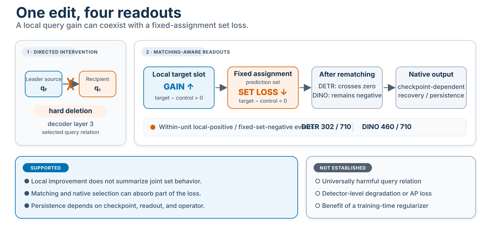

# Local Gains and Fixed-Assignment Set Losses in Shared Set Decoders

**DETR/DINO 查询关系干预、匹配感知读出与精确聚合复现**

A local query gain need not imply an improvement of the jointly decoded prediction set. This repository accompanies a study of directed query-relation deletion in shared set decoders and provides an analysis-ready package for exact aggregate reproduction.

## 60 秒概览

- **研究问题**：删除一条查询关系后，局部槽位变好，是否意味着包含它的预测集合也变好？
- **干预设计**：在两个 ResNet-50 DETR-family checkpoints 中，对选中的定向查询关系执行硬删除，并与“删除同一 leader source、但作用于另一 recorded recipient”的匹配主动对照比较。
- **多阶段读出**：分别检查局部槽位、固定分配集合、匈牙利重匹配和原生输出，避免用单个局部指标替代集合行为。
- **公开范围**：仓库公开逐图像分析表、配置、审计记录、预期聚合结果和 CPU-only 复算代码；不公开图像像素、模型权重，也不声称能够重新执行端到端模型干预。



## 核心结果

每个 checkpoint 包含 710 个配对的图像—关系单元：

| 模型 | 局部增益且固定分配集合损失 | 局部增益且重匹配后仍为损失 |
|---|---:|---:|
| DETR-R50-500 | 302 / 710 | 285 / 710 |
| DINO-R50-4scale-12epoch | 460 / 710 | 433 / 710 |

目标删除减匹配主动对照的均值在两个 checkpoint 中均呈现“局部为正、固定分配集合为负”。重匹配和原生选择吸收了足够的 DETR 平均损失，使区间跨越零；DINO 的区间仍保持为负。因此，现有证据支持的是**选择条件依赖、读出方式依赖和干预算子依赖的删除敏感性**，而不是干预不变的有害边机制、检测器整体退化或训练正则化收益。

## 这个仓库实际复现什么

论文复现轨道从冻结的 `artifact/analysis_ready/` 开始，重算 H4-D、Gate C、T1 和 T2 四组聚合结果，并在 `1e-12` 容差内与冻结结果逐字段比较：

| 组件 | 作用 |
|---|---|
| H4-D | 检查发现样本中的主要删除响应 |
| Gate C | 检查记录中的算子迁移联合条件 |
| T1 | 定位差异首先出现在哪个读出阶段 |
| T2 | 在确认样本中执行配对分类并检查强阳性对照 |

这是一份**聚合结果复现包**，不是原始训练和模型推理环境。详细边界见[科学范围](docs/scientific_scope.md)和[数据与模型来源](docs/data_and_model_provenance.md)。

## 快速验证

参考环境为 Python 3.12 和 NumPy 1.26.4。验证只使用 CPU，不需要图像、权重、GPU 或网络访问。

```powershell
python -m venv .venv
python -m pip install -e ".[test]"
python scripts/check_repository.py
```

完整检查会：

1. 校验冻结工件的大小和 SHA-256；
2. 从分析就绪数据重新计算四组聚合结果；
3. 将新结果与冻结结果精确比较；
4. 执行复现合同和辅助视觉代码的自动化测试。

成功时输出：

```text
PASS_ARTIFACT_MANIFEST
PASS_ANALYSIS_READY_EXACT_REPRODUCTION
PASS_REPOSITORY_CHECK
```

## 目录结构

| 路径 | 内容 |
|---|---|
| `artifact/analysis_ready/` | 冻结估计目标使用的逐图像分析数据 |
| `artifact/code/` | 保留的聚合与清单校验程序 |
| `artifact/audit/` | 人群、配对、映射、剂量和完整性记录 |
| `artifact/expected/` | 冻结的预期聚合结果 |
| `scripts/` | 清单验证、聚合复算和仓库总检查入口 |
| `tests/` | 证据防火墙与精确复现测试 |
| `docs/` | 研究设计、结果解释、架构和维护说明 |
| `cv_demo/` | 与论文证据隔离的辅助目标检测工程示例 |

## 辅助视觉检测示例

`cv_demo/` 提供 COCO 数据读取、DETR/DINO 输出适配、批量推理、类别感知评估、COCO 结果导出和可视化。它用于展示独立的视觉工程接口，**不生成、替换或扩展论文结果**。模型接入方式见 [`cv_demo/README.md`](cv_demo/README.md)。

## 论文状态与引用

关联论文为 **Local Gains and Fixed-Assignment Set Losses in Shared Set Decoders**。论文已于 2026-08-12 提交 arXiv，目前处于 **on hold** 状态，尚无公开永久标识符；本仓库不声明 TMLR 接收状态。

软件引用信息见 [`CITATION.cff`](CITATION.cff)。原创代码采用 MIT License；论文正文、图表、实验归档、数据、模型权重和第三方组件不自动包含在该许可中，详见 [`LICENSE_STATUS.md`](LICENSE_STATUS.md)。

## 推荐阅读顺序

1. [项目概览](docs/project_overview.md)
2. [实验映射](docs/experiment_map.md)
3. [结果解释](docs/results_guide.md)
4. [科学范围](docs/scientific_scope.md)
5. [复现合同](docs/reproducibility_contract.md)
6. [仓库架构](docs/architecture.md)
