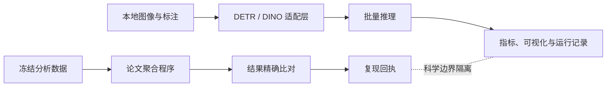

# Query-Interaction Intervention Audit

**查询交互干预审计与独立视觉检测实现**

本仓库围绕集合预测模型中的查询交互展开。论文部分从冻结的分析就绪数据重算全部聚合结果，并通过摘要校验与自动化测试防止数字漂移；独立视觉检测部分提供数据读取、模型接入、批量推理、结果评估和可视化的完整接口。两部分在目录、输出和科学结论上严格隔离。

## 研究问题

DETR、DINO 等集合预测模型通过一组查询共同生成预测。删除查询之间的关系后，被干预查询的局部读出可能改善，但按原始分配关系评估的预测集合反而可能下降。论文因此不把单个局部指标当作整体性能的替代，而是同时检查局部、固定分配、重新匹配、选择条件和原生读出等不同估计目标。

冻结证据覆盖两个模型检查点。下表给出论文中的一个核心观察：

| 模型 | 局部读出与固定分配读出方向相反 | 重新匹配后仍方向相反 |
|---|---:|---:|
| DETR | 302 / 710 | 285 / 710 |
| DINO | 460 / 710 | 433 / 710 |

这些数字来自归档证据，不由独立视觉检测代码生成。

## 仓库设计

| 轨道 | 输入 | 主要输出 | 用途 |
|---|---|---|---|
| 论文复现 | 冻结的分析就绪数据 | 四组聚合结果、校验回执 | 验证论文数字与估计目标未发生漂移 |
| 视觉检测 | 本地图像、COCO 标注、用户提供的 checkpoint | 预测、检测指标、可视化、运行记录 | 验证独立的端到端检测工程流程 |



冻结证据位于 `artifact/`。视觉检测轨道只向单独的运行目录写入结果，不能修改 `artifact/analysis_ready/` 或 `artifact/expected/`。

## 快速验证

参考环境为 Python 3.12 和 NumPy 1.26.4。

```powershell
python -m pip install -e ".[test]"
python scripts/check_repository.py
```

完整检查包括：

1. 校验 62 个冻结文件的大小和 SHA-256；
2. 从分析就绪数据重新计算 H4-D、Gate C、T1 和 T2；
3. 以 `1e-12` 容差比较新结果与冻结结果；
4. 执行论文复现与视觉检测两组单元测试。

成功时最后输出：

```text
PASS_ARTIFACT_MANIFEST
PASS_ANALYSIS_READY_EXACT_REPRODUCTION
PASS_REPOSITORY_CHECK
```

复现过程仅使用 CPU，不需要图像像素、模型权重、GPU 或网络访问。新生成的聚合结果保存在 `results/reproduced/`。

## 论文分析结构

论文将同一个问题拆成四个职责清晰的分析组件：

| 组件 | 分析目的 | 输出 |
|---|---|---|
| H4-D | 检查发现人群上的删除敏感性 | 分层自助法估计及区间 |
| Gate C | 检查预先记录的算子迁移联合条件 | 分剂量结果与联合判定 |
| T1 | 定位差异首先出现在哪个读出阶段 | 配对图像的同时区间 |
| T2 | 进行配对分类并检查强阳性对照 | 分类状态、区间与对照结果 |

两个模型始终分别分析，代码不会生成新的模型合并结果。更详细的实验映射见 [`docs/experiment_map.md`](docs/experiment_map.md)，结果解释见 [`docs/results_guide.md`](docs/results_guide.md)。

## 独立视觉检测轨道

`cv_demo/` 提供与特定第三方实现解耦的检测流程：

- 读取 COCO 格式的图像元数据、标注框和类别；
- 通过模型构建函数显式加载用户提供的 checkpoint；
- 统一接入 DETR 风格与 DINO 风格的模型输出；
- 支持模型类别编号到数据集类别编号的显式映射；
- 支持 CPU、CUDA、批量推理和固定随机种子；
- 生成逐图像预测、COCO 结果文件和检测框可视化；
- 执行类别感知的 IoU 匹配，并汇总精确率、召回率、TP、FP、FN；
- 记录配置、输入摘要、设备、随机种子和输出清单。

安装可选依赖：

```powershell
python -m pip install -e ".[demo]"
```

准备本地图像、COCO 标注、checkpoint 和模型构建函数后运行：

```powershell
python -m cv_demo.inference.predict `
  --config cv_demo/configs/demo.json `
  --builder my_backend.builders:build_demo_model
```

如果使用本地 Hugging Face DETR 目录，可直接使用仓库提供的构建函数：

```powershell
python -m pip install -e ".[huggingface]"
python -m cv_demo.inference.predict `
  --config cv_demo/configs/demo.json `
  --builder cv_demo.models.builders.huggingface_detr:build_local_model
```

该构建函数设置为仅读取本地文件，不会自动联网下载模型。

一次运行会生成：

| 文件 | 内容 |
|---|---|
| `predictions.json` | 统一内部格式的逐图像预测 |
| `coco_predictions.json` | 可交给 COCO API 的检测结果 |
| `metrics.json` | 固定 IoU 阈值下的类别感知评估 |
| `run_record.json` | 输入摘要、配置、设备、随机种子与输出清单 |
| `visualizations/` | 带预测框和置信度的图像 |

运行记录只保存文件名、大小和 SHA-256，不保存本机绝对路径。模型接入契约与配置说明见 [`cv_demo/README.md`](cv_demo/README.md)。

## 质量控制

- 冻结工件清单对每个文件执行 SHA-256 校验；
- 论文结果由保留的原始聚合程序重算，避免另写一套实现造成分叉；
- 测试覆盖证据防火墙、精确复现、COCO 数据读取、类别感知匹配、标准结果导出、可视化和运行记录；
- 仓库检查脚本可在干净环境中执行同一套检查；
- 生成目录、缓存和本地权重不进入版本控制。

## 科学结论边界

论文证据支持的是：在记录中的人群、干预和估计目标下，删除敏感性依赖于选择条件、算子和读出方式。

现有证据不支持把结果扩大为通用的有害查询边、干预不变机制、检测器整体退化、总体发生率、已校准的算子迁移或训练正则化结论。

H4-D 中的原生读出是分解分析下的派生摘要；T0 统一估计目标审计中的原生端点具有不同定义和用途。两者不合并、不替代，也不跨表比较。

## 目录说明

| 路径 | 内容 |
|---|---|
| `artifact/analysis_ready/` | 冻结估计目标使用的逐图像分析数据 |
| `artifact/code/` | 保留的聚合与清单校验程序 |
| `artifact/audit/` | 人群、配对、映射、剂量和完整性记录 |
| `artifact/expected/` | 冻结的预期聚合结果 |
| `scripts/` | 论文复现与仓库总检查入口 |
| `tests/` | 论文复现测试 |
| `cv_demo/` | 独立视觉检测实现及测试 |
| `docs/` | 研究设计、结果解释、架构和维护说明 |

## 引用与许可

论文引用信息见 [`CITATION.cff`](CITATION.cff)。原创源代码采用 MIT License，适用范围见根目录 [`LICENSE`](LICENSE)。

论文正文、图表、实验归档、数据、模型权重和第三方组件不自动包含在该许可中，
其使用须遵守相应的版权和许可证条款。
